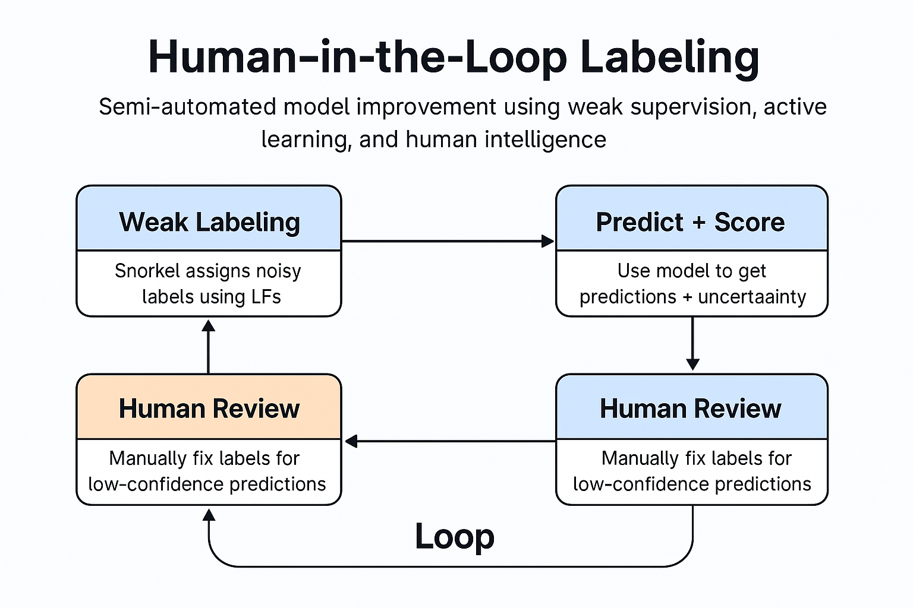

# 🚀 AutoLabelX: Human-in-the-Loop Text Labeling Framework

AutoLabelX is a semi-automated pipeline for scalable and intelligent text data labeling. It combines **weak supervision (Snorkel)**, **active learning (uncertainty sampling)**, and **human-in-the-loop feedback** to reduce manual labeling effort and iteratively improve model performance.

---

## 🔍 Project Highlights

- ⚙️ **Weak Supervision with Snorkel**: Label large unlabeled text datasets using pattern-based Labeling Functions (LFs).
- 🧠 **DistilBERT Classifier**: Trains an initial classifier on weak labels.
- ❓ **Uncertainty Sampling**: Identifies low-confidence predictions to prioritize human review.
- 🙋‍♂️ **Streamlit Review Dashboard**: Lets users correct uncertain predictions via a user-friendly interface.
- 🔁 **Retrain Loop**: Human feedback is merged and used to refine the model.

---

## 🔁 Workflow Overview



---
## 📁 Project Structure

```
AutoLabelX/
│
├── data/ # Raw, processed, and labeled datasets
│ ├── raw/
│ ├── processed/
│ └── labeling_outputs/
│
├── labeling/ # Snorkel labeling functions + label model
│ ├── labeling_functions.py
│ └── apply_label_model.py
│
├── active_learning/ # Training and review loop
│ ├── train_model.py
│ ├── uncertainty_sampling.py
│ ├── streamlit_dashboard.py
│ └── label_store/
│
├── models/ # Fine-tuned transformer models
│
├── scripts/ # Data preparation and preprocessing
│ └── prepare_agnews.py
│ └── preprocess_text.py
│
├── requirements.txt
```

## 📊 Tech Stack
- Python, Pandas, Scikit-learn

- Transformers (Hugging Face)

- Snorkel for weak supervision

- Streamlit for feedback interface

- Torch for model training

---

## 🧪 How It Works

1. **Prepare Data**: Load and clean the AG News dataset (`scripts/prepare_agnews.py`)
2. **Apply Weak Supervision**: Use Snorkel LFs to weakly label data (`labeling/apply_label_model.py`)
3. **Train Initial Model**: Fine-tune DistilBERT on weak labels (`active_learning/train_model.py`)
4. **Uncertainty Sampling**: Extract low-confidence samples (`uncertainty_sampling.py`)
5. **Human Feedback**: Use Streamlit dashboard to review (`streamlit_dashboard.py`)
6. **Retrain with Human Labels**: Merge and retrain model for continuous improvement

---

## 🤝 Acknowledgements
- [Snorkel](https://www.snorkel.org/)

- [HuggingFace Transformers](https://huggingface.co/docs/transformers/index)

- [AG News Dataset](https://huggingface.co/datasets/fancyzhx/ag_news)

---
## 👤 Author

**Hrushikesh Attarde**  
[LinkedIn](https://www.linkedin.com/in/hrushikesh-attarde) · [GitHub](https://github.com/Rukki2705)
